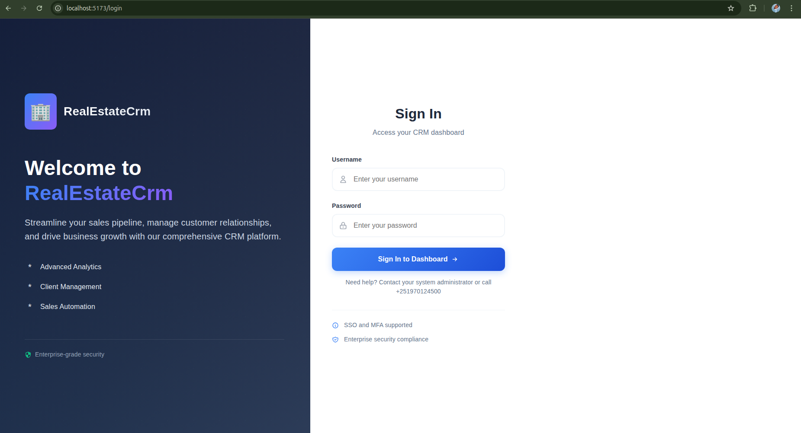
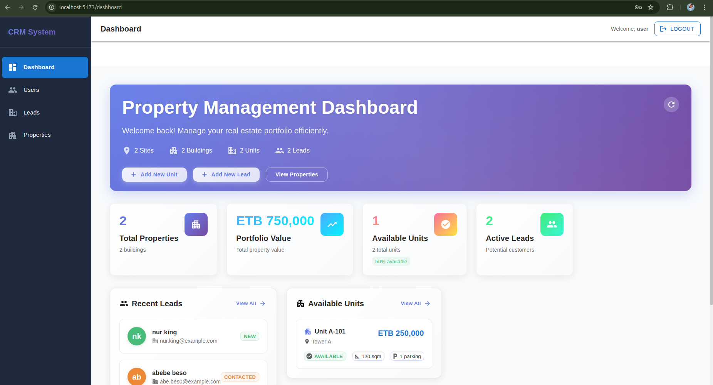
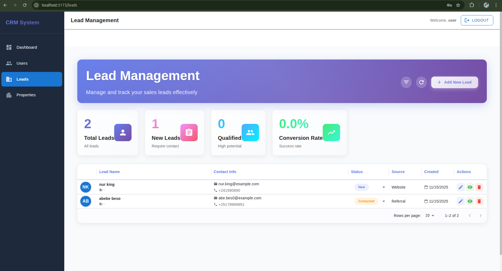
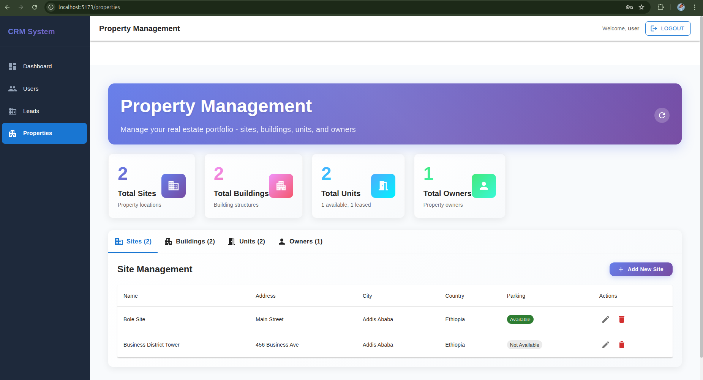
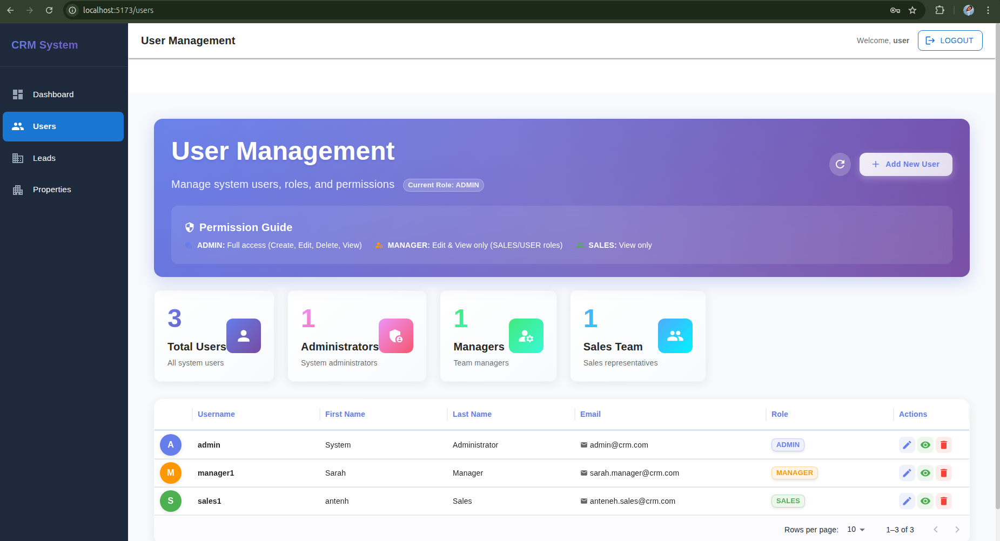

# Real Estate CRM

A full-stack Customer Relationship Management system for real estate agencies built with Spring Boot backend and React TypeScript frontend.

## Project Overview

A comprehensive CRM solution designed specifically for real estate professionals to manage properties, track leads, and analyze business performance. Built with modern technologies and scalable architecture.

## Development Team

| Role | Team Member | Responsibilities |
|------|-------------|------------------|
| Backend Core & Security | Gedion | Authentication, Security, API Architecture |
| Property Management APIs | Rediet | Property CRUD, Database Design |
| Frontend Foundation & UI | Nardos | React Architecture, Component Library |
| Property Management UI | Nebiyat | Property Interfaces, User Experience |
| Leads & Analytics | Meaza & Nurye | Lead Tracking, Dashboard, Reporting |

## Technology Stack

### Backend
- Java 17 - Core programming language
- Spring Boot 3.x - Application framework
- Spring Security - Authentication & Authorization
- JWT - Secure token-based authentication
- PostgreSQL - Primary database
- Maven - Dependency management
- Docker - Containerization

### Frontend
- React 18 - User interface library
- TypeScript - Type-safe JavaScript
- React Router - Navigation and routing
- Axios - HTTP client for API calls
- Modern CSS - Responsive styling

### DevOps & Infrastructure
- Docker - Containerization
- Docker Compose - Multi-container orchestration
- REST API - Stateless communication

## Features

### Core Functionality
- **User Authentication** - Secure login/register with JWT tokens
- **Property Management** - Complete CRUD operations for sites, buildings, units, and owners
- **Lead Management** - Track potential clients and conversion pipeline
- **Analytics Dashboard** - Business insights and performance reporting
- **Responsive Design** - Optimized for desktop and mobile devices

### Business Capabilities
- Property inventory management
- Client relationship tracking
- Sales pipeline monitoring
- Commission tracking
- Performance analytics

## Application Screenshots

### Login Page

Secure authentication interface with role-based access control

### User Dashboard

Comprehensive overview of system activities and performance metrics

### Lead Management

Complete lead tracking with company information and status management

### Property Management

Property listing management with hierarchical organization

### User Management

Administrative interface for user management and permissions

## Quick Start

### Prerequisites
- Java 17 or higher
- Node.js 16 or higher
- PostgreSQL 12 or higher
- Docker and Docker Compose (recommended)

### Docker Deployment (Recommended)

```bash
# Clone the repository
git clone https://github.com/NuryeNigusMekonen/real_state_crm.git
cd real_state_crm

# Start all services
docker-compose up -d
```

Application endpoints:
- Frontend Application: http://localhost:3000
- Backend API: http://localhost:8080
- Database: localhost:5432

### Manual Development Setup

```bash
# Backend Service
cd backend
./mvnw spring-boot:run

# Frontend Application (separate terminal)
cd frontend
npm install
npm start
```

## Project Architecture

```
real_state_crm/
├── backend/                 # Spring Boot Application
│   ├── src/main/java/
│   │   └── com/realestatecrm/
│   │       ├── config/      # Security & Application Configuration
│   │       ├── entity/      # JPA Entities & Database Models
│   │       ├── service/     # Business Logic Layer
│   │       ├── controller/  # REST API Endpoints
│   │       ├── repository/  # Data Access Layer
│   │       └── security/    # Authentication & Authorization
│   └── src/main/resources/  # Application Properties & Configuration
├── frontend/                # React TypeScript Application
│   └── src/
│       ├── components/      # Reusable UI Components
│       ├── pages/           # Application Pages
│       ├── hooks/           # Custom React Hooks
│       ├── types/           # TypeScript Type Definitions
│       ├── api/             # API Client Services
│       └── utils/           # Utility Functions
├── screenshoots/            # Application Screenshots
│   ├── loginpage.png
│   ├── userdashboard.png
│   ├── leadpage.png
│   ├── proopertypage.png
│   └── userpage.png
└── docker-compose.yml       # Container Orchestration
```

## Development Workflow

For detailed development instructions, team responsibilities, and workflow guidelines, refer to [DEVELOPMENT.md](DEVELOPMENT.md).

### Key Development Principles
- Each team member operates on dedicated feature branches
- Follow established merge order and code review processes
- Maintain clean commit history with descriptive messages
- Ensure comprehensive testing before integration

## API Documentation

Once the application is running, access the API documentation:
- Swagger UI: http://localhost:8080/swagger-ui.html
- REST API Endpoints: http://localhost:8080/api

## Database Schema

The application utilizes a relational database with the following core entities:
- **Users** - Authentication and authorization management
- **Sites, Buildings, BuildingUnits** - Property hierarchy management
- **Owners** - Property ownership records
- **Leads** - Customer relationship management
- **CommissionRecords** - Sales and commission tracking

## Contributing

This project follows specific team development workflows. Please refer to the DEVELOPMENT.md file for detailed contribution guidelines, team coordination procedures, and code review requirements.

## License

This project is developed for educational and professional purposes as part of a collaborative team exercise.

## Support

For technical issues or questions about specific application components, please contact the respective team member responsible for that area of the application.

---

**Built with modern development practices and team collaboration at its core.**